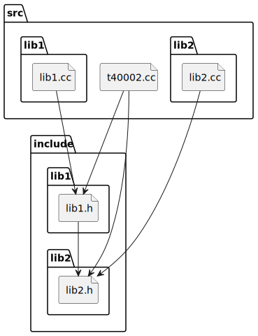

# t40002 - Cyclic include graph diagram test case
## Config
```yaml
diagrams:
  t40002_include:
    type: include
    # Provide the files to parse in order to look
    # for #include directives
    glob:
      - src/t40002.cc
      - src/lib1/lib1.cc
      - src/lib2/lib2.cc
    include:
      # Include only files belonging to these paths relative to relative_to
      paths:
        - .
    exclude:
      paths:
        # Exclude single header relative to relative_to
        - include/lib2/lib2_detail.h
    plantuml:
      before:
        - "' t40002 test include diagram"
```
## Source code
File `tests/t40002/src/t40002.cc`
```cpp
#include "../include/lib1/lib1.h"
#include "../include/lib2/lib2.h"

namespace clanguml::t40002 {

int foo() { return lib1::foo() + lib2::foo(); }

}
```
File `tests/t40002/src/lib1/lib1.cc`
```cpp
#include "../../include/lib1/lib1.h"

#include <string>

namespace clanguml::t40002::lib1 {

int foo0() { return 0; }

int foo1() { return 1; }

int foo() { return foo1(); }

}
```
File `tests/t40002/src/lib2/lib2.cc`
```cpp
#include "../../include/lib2/lib2.h"
#include "../../include/lib2/lib2_detail.h"

namespace clanguml::t40002::lib2 {

int foo0() { return 0; }

int foo1() { return 1; }

int foo() { return foo1(); }

int foo22() { return 22; }

} // namespace clanguml::t40002::lib2
```
File `tests/t40002/include/lib1/lib1.h`
```cpp
#pragma once

#include "../lib2/lib2.h"

#include <string>

namespace clanguml::t40002::lib1 {

int foo0();

int foo1();

int foo();

}
```
File `tests/t40002/include/lib2/lib2_detail.h`
```cpp
#pragma once

namespace clanguml::t40002::lib2::detail {

int foo22();

}
```
File `tests/t40002/include/lib2/lib2.h`
```cpp
#pragma once

#include "lib2_detail.h"

namespace clanguml::t40002::lib2 {

int foo2();

int foo3();

int foo();

}
```
## Generated PlantUML diagrams

## Generated Mermaid diagrams

## Generated JSON models
```json
{
  "diagram_type": "include",
  "elements": [
    {
      "display_name": "src",
      "elements": [
        {
          "display_name": "src/t40002.cc",
          "file_kind": "implementation",
          "id": "1489450289909741706",
          "name": "t40002.cc",
          "type": "file"
        },
        {
          "display_name": "src/lib1",
          "elements": [
            {
              "display_name": "src/lib1/lib1.cc",
              "file_kind": "implementation",
              "id": "1493913207373215402",
              "name": "lib1.cc",
              "type": "file"
            }
          ],
          "id": "1284742705549910910",
          "name": "lib1",
          "type": "folder"
        },
        {
          "display_name": "src/lib2",
          "elements": [
            {
              "display_name": "src/lib2/lib2.cc",
              "file_kind": "implementation",
              "id": "1761875020766116446",
              "name": "lib2.cc",
              "type": "file"
            }
          ],
          "id": "1397224709580110803",
          "name": "lib2",
          "type": "folder"
        }
      ],
      "id": "1387619747296316447",
      "name": "src",
      "type": "folder"
    },
    {
      "display_name": "include",
      "elements": [
        {
          "display_name": "include/lib1",
          "elements": [
            {
              "display_name": "include/lib1/lib1.h",
              "file_kind": "header",
              "id": "2193549214042244690",
              "is_system": false,
              "name": "lib1.h",
              "type": "file"
            }
          ],
          "id": "1687675335949018432",
          "name": "lib1",
          "type": "folder"
        },
        {
          "display_name": "include/lib2",
          "elements": [
            {
              "display_name": "include/lib2/lib2.h",
              "file_kind": "header",
              "id": "1969674835696841438",
              "is_system": false,
              "name": "lib2.h",
              "type": "file"
            }
          ],
          "id": "1248530620501446930",
          "name": "lib2",
          "type": "folder"
        }
      ],
      "id": "989412417490706876",
      "name": "include",
      "type": "folder"
    }
  ],
  "name": "t40002_include",
  "relationships": [
    {
      "destination": "2193549214042244690",
      "source": "1489450289909741706",
      "type": "association"
    },
    {
      "destination": "1969674835696841438",
      "source": "1489450289909741706",
      "type": "association"
    },
    {
      "destination": "2193549214042244690",
      "source": "1493913207373215402",
      "type": "association"
    },
    {
      "destination": "1969674835696841438",
      "source": "1761875020766116446",
      "type": "association"
    },
    {
      "destination": "1969674835696841438",
      "source": "2193549214042244690",
      "type": "association"
    }
  ]
}
```
