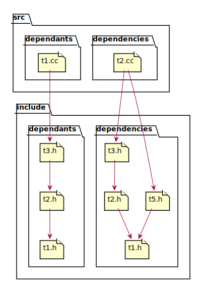

# t40003 - Dependants and dependencies include diagram filter test
## Config
```yaml
diagrams:
  t40003_include:
    type: include
    # Provide the files to parse in order to look
    # for #include directives
    glob:
      - src/dependants/t1.cc
      - src/dependencies/t2.cc
    # Render the paths relative to this directory
    include:
      # Include only files which depend on t1.h
      dependants:
        - include/dependants/t1.h
      # and dependencies of t2.cc
      dependencies:
        - src/dependencies/t2.cc
    plantuml:
      before:
        - "' t40003 test include diagram"
```
## Source code
File `tests/t40003/src/dependencies/t2.cc`
```cpp
#include "../../include/dependencies/t3.h"
#include "../../include/dependencies/t5.h"

namespace clanguml::t40003::dependencies {
void t()
{
    t3();
    t5();
}
}
```
File `tests/t40003/src/dependants/t1.cc`
```cpp
#include "../../include/dependants/t3.h"
#include "../../include/dependants/t4.h"

namespace clanguml::t40003::dependants {
void t()
{
    t3();
    t4();
}
}
```
File `tests/t40003/include/dependencies/t3.h`
```cpp
#pragma once

#include "t2.h"

namespace clanguml::t40003::dependencies {
void t3() { t2(); }
}
```
File `tests/t40003/include/dependencies/t1.h`
```cpp
#pragma once

namespace clanguml::t40003::dependencies {
void t1() { }
}
```
File `tests/t40003/include/dependencies/t6.h`
```cpp
#pragma once

#include "t1.h"

namespace clanguml::t40003::dependencies {
void t6() { t1(); }
}
```
File `tests/t40003/include/dependencies/t5.h`
```cpp
#pragma once

#include "t1.h"

namespace clanguml::t40003::dependencies {
void t5() { t1(); }
}
```
File `tests/t40003/include/dependencies/t2.h`
```cpp
#pragma once

#include "t1.h"

namespace clanguml::t40003::dependencies {
void t2() { t1(); }
}
```
File `tests/t40003/include/dependants/t3.h`
```cpp
#pragma once

#include "t2.h"

namespace clanguml::t40003::dependants {
void t3() { t2(); }
}
```
File `tests/t40003/include/dependants/t4.h`
```cpp
#pragma once

namespace clanguml::t40003::dependants {
void t4() { }
}
```
File `tests/t40003/include/dependants/t1.h`
```cpp
#pragma once

namespace clanguml::t40003::dependants {
void t1() { }
}
```
File `tests/t40003/include/dependants/t2.h`
```cpp
#pragma once

#include "t1.h"

namespace clanguml::t40003::dependants {
void t2() { t1(); }
}
```
## Generated PlantUML diagrams

## Generated Mermaid diagrams

## Generated JSON models
```json
{
  "diagram_type": "include",
  "elements": [
    {
      "display_name": "src",
      "elements": [
        {
          "display_name": "src/dependants",
          "elements": [
            {
              "display_name": "src/dependants/t1.cc",
              "file_kind": "implementation",
              "id": "1215324434184692437",
              "name": "t1.cc",
              "type": "file"
            }
          ],
          "id": "1128556599972003761",
          "name": "dependants",
          "type": "folder"
        },
        {
          "display_name": "src/dependencies",
          "elements": [
            {
              "display_name": "src/dependencies/t2.cc",
              "file_kind": "implementation",
              "id": "2215849176605856058",
              "name": "t2.cc",
              "type": "file"
            }
          ],
          "id": "2015386828772336316",
          "name": "dependencies",
          "type": "folder"
        }
      ],
      "id": "1387619747296316447",
      "name": "src",
      "type": "folder"
    },
    {
      "display_name": "include",
      "elements": [
        {
          "display_name": "include/dependants",
          "elements": [
            {
              "display_name": "include/dependants/t3.h",
              "file_kind": "header",
              "id": "60001020671836182",
              "is_system": false,
              "name": "t3.h",
              "type": "file"
            },
            {
              "display_name": "include/dependants/t2.h",
              "file_kind": "header",
              "id": "1921842892192045013",
              "is_system": false,
              "name": "t2.h",
              "type": "file"
            },
            {
              "display_name": "include/dependants/t1.h",
              "file_kind": "header",
              "id": "2295271780650013565",
              "is_system": false,
              "name": "t1.h",
              "type": "file"
            }
          ],
          "id": "1763526330848915994",
          "name": "dependants",
          "type": "folder"
        },
        {
          "display_name": "include/dependencies",
          "elements": [
            {
              "display_name": "include/dependencies/t3.h",
              "file_kind": "header",
              "id": "1226843223635488673",
              "is_system": false,
              "name": "t3.h",
              "type": "file"
            },
            {
              "display_name": "include/dependencies/t2.h",
              "file_kind": "header",
              "id": "1849348825646635129",
              "is_system": false,
              "name": "t2.h",
              "type": "file"
            },
            {
              "display_name": "include/dependencies/t1.h",
              "file_kind": "header",
              "id": "1120257488305564427",
              "is_system": false,
              "name": "t1.h",
              "type": "file"
            },
            {
              "display_name": "include/dependencies/t5.h",
              "file_kind": "header",
              "id": "2106129159239499468",
              "is_system": false,
              "name": "t5.h",
              "type": "file"
            }
          ],
          "id": "1833478793852674517",
          "name": "dependencies",
          "type": "folder"
        }
      ],
      "id": "989412417490706876",
      "name": "include",
      "type": "folder"
    }
  ],
  "name": "t40003_include",
  "relationships": [
    {
      "destination": "60001020671836182",
      "source": "1215324434184692437",
      "type": "association"
    },
    {
      "destination": "1882940911178525353",
      "source": "1215324434184692437",
      "type": "association"
    },
    {
      "destination": "1226843223635488673",
      "source": "2215849176605856058",
      "type": "association"
    },
    {
      "destination": "2106129159239499468",
      "source": "2215849176605856058",
      "type": "association"
    },
    {
      "destination": "1921842892192045013",
      "source": "60001020671836182",
      "type": "association"
    },
    {
      "destination": "2295271780650013565",
      "source": "1921842892192045013",
      "type": "association"
    },
    {
      "destination": "1849348825646635129",
      "source": "1226843223635488673",
      "type": "association"
    },
    {
      "destination": "1120257488305564427",
      "source": "1849348825646635129",
      "type": "association"
    },
    {
      "destination": "1120257488305564427",
      "source": "2106129159239499468",
      "type": "association"
    }
  ]
}
```
