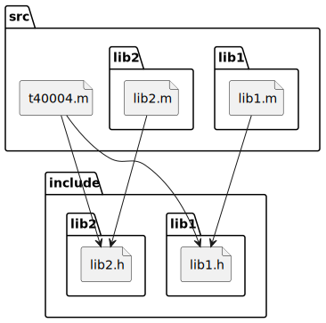

# t40004 - Objective C include diagram test
## Config
```yaml
diagrams:
  t40004_include:
    type: include
    glob:
      - src/lib1/lib1.m
      - src/lib2/lib2.m
      - src/t40004.m
    include:
      paths:
        - include
        - src
```
## Source code
File `tests/t40004/src/t40004.m`
```cpp
#include "../include/lib1/lib1.h"
#include "../include/lib2/lib2.h"


@interface t40004_D : NSObject {
}

@property (nonatomic, assign) Lib1 *l1;
@property (nonatomic, assign) Lib2 *l2;


@end
```
File `tests/t40004/src/lib1/lib1.m`
```cpp
#include "../../include/lib1/lib1.h"
```
File `tests/t40004/src/lib2/lib2.m`
```cpp
#include "../../include/lib2/lib2.h"
```
File `tests/t40004/include/lib1/lib1.h`
```cpp
#pragma once

#include <Foundation/Foundation.h>

@interface Lib1 : NSObject

@end
```
File `tests/t40004/include/lib2/lib2.h`
```cpp
#pragma once

#include <Foundation/Foundation.h>

@interface Lib2 : NSObject

@end
```
## Generated PlantUML diagrams

## Generated Mermaid diagrams

## Generated JSON models
```json
{
  "diagram_type": "include",
  "elements": [
    {
      "display_name": "src",
      "elements": [
        {
          "display_name": "src/lib1",
          "elements": [
            {
              "display_name": "src/lib1/lib1.m",
              "file_kind": "implementation",
              "id": "8439140978974674742",
              "name": "lib1.m",
              "type": "file"
            }
          ],
          "id": "10277941644399287283",
          "name": "lib1",
          "type": "folder"
        },
        {
          "display_name": "src/lib2",
          "elements": [
            {
              "display_name": "src/lib2/lib2.m",
              "file_kind": "implementation",
              "id": "13476008407962402737",
              "name": "lib2.m",
              "type": "file"
            }
          ],
          "id": "11177797676640886425",
          "name": "lib2",
          "type": "folder"
        },
        {
          "display_name": "src/t40004.m",
          "file_kind": "implementation",
          "id": "857999852472475557",
          "name": "t40004.m",
          "type": "file"
        }
      ],
      "id": "11100957978370531577",
      "name": "src",
      "type": "folder"
    },
    {
      "display_name": "include",
      "elements": [
        {
          "display_name": "include/lib1",
          "elements": [
            {
              "display_name": "include/lib1/lib1.h",
              "file_kind": "header",
              "id": "17548393712337957522",
              "is_system": false,
              "name": "lib1.h",
              "type": "file"
            }
          ],
          "id": "13501402687592147456",
          "name": "lib1",
          "type": "folder"
        },
        {
          "display_name": "include/lib2",
          "elements": [
            {
              "display_name": "include/lib2/lib2.h",
              "file_kind": "header",
              "id": "15757398685574731504",
              "is_system": false,
              "name": "lib2.h",
              "type": "file"
            }
          ],
          "id": "9988244964011575444",
          "name": "lib2",
          "type": "folder"
        }
      ],
      "id": "7915299339925655008",
      "name": "include",
      "type": "folder"
    }
  ],
  "name": "t40004_include",
  "relationships": [
    {
      "destination": "17548393712337957522",
      "source": "8439140978974674742",
      "type": "association"
    },
    {
      "destination": "15757398685574731504",
      "source": "13476008407962402737",
      "type": "association"
    },
    {
      "destination": "17548393712337957522",
      "source": "857999852472475557",
      "type": "association"
    },
    {
      "destination": "15757398685574731504",
      "source": "857999852472475557",
      "type": "association"
    }
  ]
}
```
## Generated GraphML models
```xml
<?xml version="1.0"?>
<graphml xmlns="http://graphml.graphdrawing.org/xmlns" xmlns:xsi="http://www.w3.org/2001/XMLSchema-instance" xsi:schemaLocation="http://graphml.graphdrawing.org/xmlns http://graphml.graphdrawing.org/xmlns/1.0/graphml.xsd">
 <key attr.name="id" attr.type="string" for="graph" id="gd0" />
 <key attr.name="diagram_type" attr.type="string" for="graph" id="gd1" />
 <key attr.name="name" attr.type="string" for="graph" id="gd2" />
 <key attr.name="using_namespace" attr.type="string" for="graph" id="gd3" />
 <key attr.name="id" attr.type="string" for="node" id="nd0" />
 <key attr.name="type" attr.type="string" for="node" id="nd1" />
 <key attr.name="name" attr.type="string" for="node" id="nd2" />
 <key attr.name="stereotype" attr.type="string" for="node" id="nd3" />
 <key attr.name="url" attr.type="string" for="node" id="nd4" />
 <key attr.name="tooltip" attr.type="string" for="node" id="nd5" />
 <key attr.name="is_system" attr.type="boolean" for="node" id="nd6" />
 <key attr.name="type" attr.type="string" for="edge" id="ed0" />
 <key attr.name="access" attr.type="string" for="edge" id="ed1" />
 <key attr.name="label" attr.type="string" for="edge" id="ed2" />
 <key attr.name="url" attr.type="string" for="edge" id="ed3" />
 <graph id="g0" edgedefault="directed" parse.nodeids="canonical" parse.edgeids="canonical" parse.order="nodesfirst">
  <node id="n0">
   <data key="nd2">src</data>
   <data key="nd1">folder</data>
   <graph id="g1" edgedefault="directed" parse.nodeids="canonical" parse.edgeids="canonical" parse.order="nodesfirst">
    <node id="n1">
     <data key="nd2">lib1</data>
     <data key="nd1">folder</data>
     <graph id="g2" edgedefault="directed" parse.nodeids="canonical" parse.edgeids="canonical" parse.order="nodesfirst">
      <node id="n2">
       <data key="nd1">file</data>
       <data key="nd2"><![CDATA[lib1.m]]></data>
       <data key="nd3">source</data>
      </node>
     </graph>
    </node>
    <node id="n3">
     <data key="nd2">lib2</data>
     <data key="nd1">folder</data>
     <graph id="g3" edgedefault="directed" parse.nodeids="canonical" parse.edgeids="canonical" parse.order="nodesfirst">
      <node id="n4">
       <data key="nd1">file</data>
       <data key="nd2"><![CDATA[lib2.m]]></data>
       <data key="nd3">source</data>
      </node>
     </graph>
    </node>
    <node id="n5">
     <data key="nd1">file</data>
     <data key="nd2"><![CDATA[t40004.m]]></data>
     <data key="nd3">source</data>
    </node>
   </graph>
  </node>
  <node id="n6">
   <data key="nd2">include</data>
   <data key="nd1">folder</data>
   <graph id="g4" edgedefault="directed" parse.nodeids="canonical" parse.edgeids="canonical" parse.order="nodesfirst">
    <node id="n7">
     <data key="nd2">lib1</data>
     <data key="nd1">folder</data>
     <graph id="g5" edgedefault="directed" parse.nodeids="canonical" parse.edgeids="canonical" parse.order="nodesfirst">
      <node id="n8">
       <data key="nd1">file</data>
       <data key="nd2"><![CDATA[lib1.h]]></data>
       <data key="nd3">header</data>
      </node>
     </graph>
    </node>
    <node id="n9">
     <data key="nd2">lib2</data>
     <data key="nd1">folder</data>
     <graph id="g6" edgedefault="directed" parse.nodeids="canonical" parse.edgeids="canonical" parse.order="nodesfirst">
      <node id="n10">
       <data key="nd1">file</data>
       <data key="nd2"><![CDATA[lib2.h]]></data>
       <data key="nd3">header</data>
      </node>
     </graph>
    </node>
   </graph>
  </node>
  <edge id="e0" source="n2" target="n8">
   <data key="ed0">association</data>
  </edge>
  <edge id="e1" source="n4" target="n10">
   <data key="ed0">association</data>
  </edge>
  <edge id="e2" source="n5" target="n8">
   <data key="ed0">association</data>
  </edge>
  <edge id="e3" source="n5" target="n10">
   <data key="ed0">association</data>
  </edge>
 </graph>
</graphml>

```
