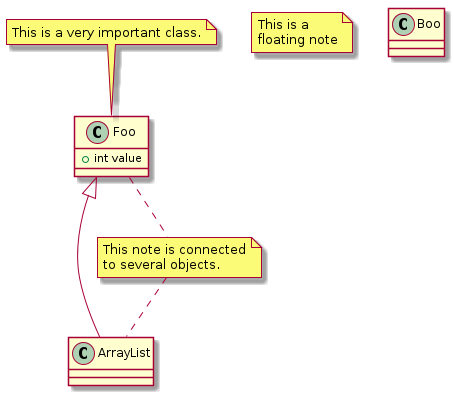

# t90000 - Basic config test
## Config
```yaml
compilation_database_dir: ..
output_directory: puml
diagrams:
  t90000_class:
    type: class
    plantuml:
      before:
        - 'class "Foo" as C_001'
        - 'class C_001 {'
        - ' +int value'
        - '}'
        - 'C_001 <|-- ArrayList'
        - 'note top of C_001: This is a very important class.'
        - 'note "This is a\nfloating note" as N1'
        - 'note "This note is connected\nto several objects." as N2'
        - 'C_001 .. N2'
        - 'N2 .. ArrayList'
        - 'class "Boo" as C_002'
        - 'class C_002 {'
        - '}'

```
## Source code
File t90000.cc
```cpp

```
## Generated UML diagrams

