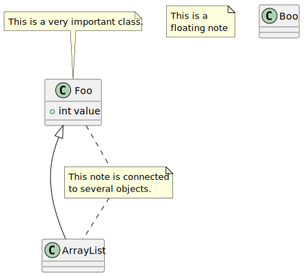

# t90000 - Basic config test
## Config
```yaml
allow_empty_diagrams: true
diagrams:
  t90000_class:
    type: class
    plantuml:
      before:
        - 'class "Foo" as C_001'
        - 'class C_001 {'
        - ' +int value'
        - '}'
        - 'C_001 <|-- ArrayList'
        - 'note top of C_001: This is a very important class.'
        - 'note "This is a\nfloating note" as N1'
        - 'note "This note is connected\nto several objects." as N2'
        - 'C_001 .. N2'
        - 'N2 .. ArrayList'
        - 'class "Boo" as C_002'
        - 'class C_002 {'
        - '}'
    mermaid:
      before:
        - 'class C_001["Foo"]'
        - 'class C_001 {'
        - ' +int value'
        - '}'
        - 'C_001 <|-- ArrayList'
        - 'note for C_001 "This is a very important class."'
        - 'note "This is a\nfloating note"'
        - 'class C_002["Boo"]'
        - 'class C_002 {'
        - '}'

```
## Source code
File `tests/t90000/t90000.cc`
```cpp

```
## Generated PlantUML diagrams

## Generated Mermaid diagrams

## Generated JSON models
```json
{
  "diagram_type": "class",
  "elements": [],
  "name": "t90000_class",
  "package_type": "namespace",
  "relationships": []
}
```
